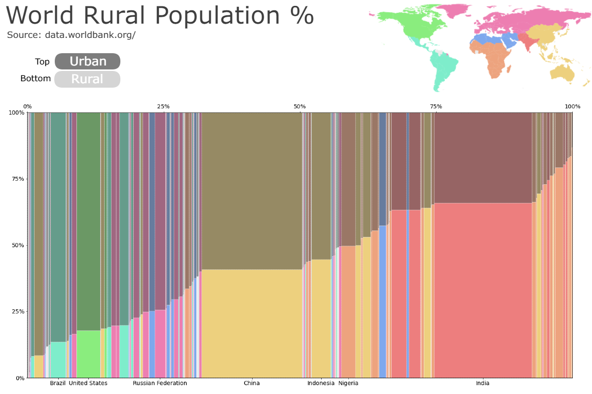

# Marimekko-charts
How to draw Marimekko charts with Matplotlib and add interactivity with Streamlit 

## Requirements
`pip install matplotlib`  
`pip install pandas`  
`pip install streamlit`  

## Streamlit
`streamlit run marimekko.py`

## Article
[Marimekko Charts with Python’s Matplotlib](https://thiago-bernardes-carvalho.medium.com/marimekko-charts-with-pythons-matplotlib-6b9784ae73a1)

## Data
[World Bank](https://data.worldbank.org/)  
  
## Examples

