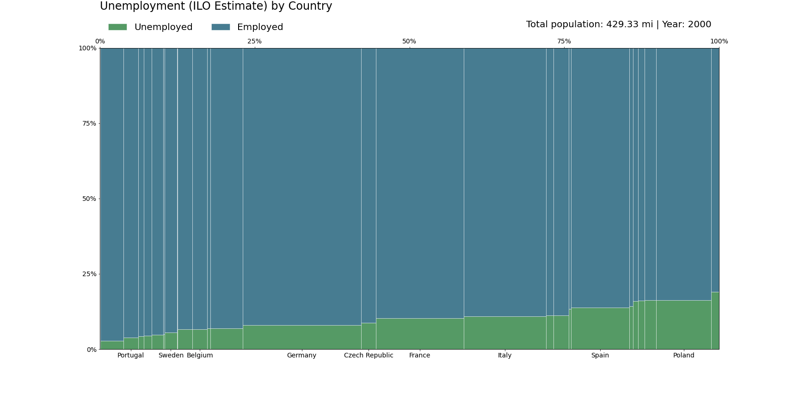
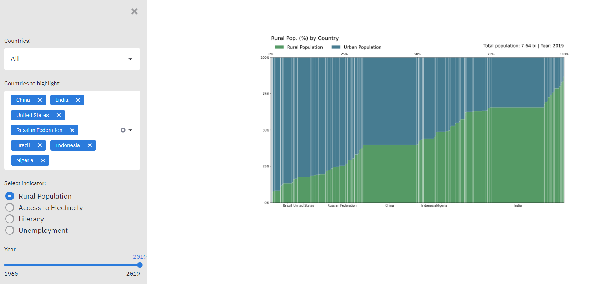

# Marimekko-charts
How to draw Marimekko charts with Matplotlib and add interactivity with Streamlit 

## Requirements
`pip install matplotlib`  
`pip install pandas`  
`pip install streamlit`  

## Data
[World Bank](https://data.worldbank.org/)  
  
## Examples

